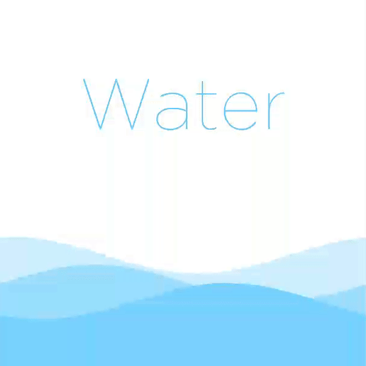

1. Wave View
==================



2. Gradle Dependency
==================

### Dependency

```Gradle
dependencies {
    compile 'com.rstudio.view:waveview:0.1'
}
```

3. Usage
==================

Add WaveView to your XML:

```XML
<com.rstudio.view.waveview.WaveView
            android:layout_width="match_parent"
            android:layout_height="300dp"
            android:id="@+id/view">
</com.rstudio.view.waveview.WaveView>
```

You need to call `.start()` to start animation:

```java
WaveView view = (WaveView) findViewById(R.id.view);
view.start();
```

Stop animation:

```java
WaveView view = (WaveView) findViewById(R.id.view);
view.stop();
```

### Change height of waves

```java
view.increaseWaveHeight(0.4f);
view.increaseWaveHeight(-0.4f);
```

### Change gap between waves

```java
view.setWaveGap(1.2f);
view.setWaveGap(0.4f);
```

### Change wave color

```java
view.setWaveColors(getContext().getResources().getColor(R.color.wave_color_1)
                     , getContext().getResources().getColor(R.color.wave_color_2)
                     , getContext().getResources().getColor(R.color.wave_color_3));
```

Or use default color palette

```java
view.setWaveColorPalette(WaveView.WaveColorPalette.PINK);
view.setWaveColorPalette(WaveView.WaveColorPalette.GREEN);
view.setWaveColorPalette(WaveView.WaveColorPalette.BLUE);
```